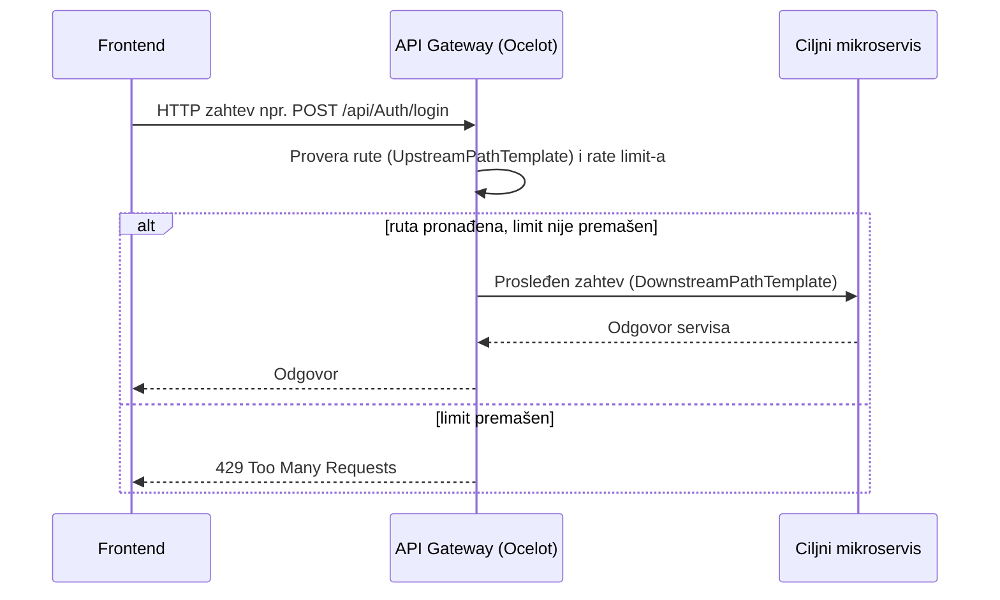

# API Gateway (JobLess.ApiGateway)

Jedinstvena ulazna tačka (single entry point) za sve klijentske zahteve ka JobLess sistemu. Implementiran je pomoću biblioteke [**Ocelot**](https://ocelot.readthedocs.io/) i ne sadrži sopstvenu poslovnu logiku — isključivo prosleđuje (proxy-uje) HTTP zahteve odgovarajućem mikroservisu na osnovu putanje, i primenjuje rate limiting.

Frontend aplikacija nikada ne komunicira direktno ni sa jednim mikroservisom — svi pozivi idu na Gateway (`http://localhost:5000`), koji ih dalje rutira.

## Sadržaj

- [Uloga u arhitekturi](#uloga-u-arhitekturi)
- [Rute](#rute)
- [Rate limiting](#rate-limiting)
- [Konfiguracija po okruženju](#konfiguracija-po-okruženju)
- [Dodavanje nove rute](#dodavanje-nove-rute)
- [Pokretanje](#pokretanje)

## Uloga u arhitekturi



Gateway ne validira JWT niti dodaje autorizaciju — svaki downstream servis samostalno validira `Authorization: Bearer` header koji je frontend već postavio. Gateway samo rutira zahtev, uključujući i taj header, ka odgovarajućem servisu.

## Rute

Sve rute su definisane u fajlu `ocelot.{Environment}.json`, sa istim obrascem: upstream putanja `{everything}` se 1:1 preslikava na downstream putanju istog oblika kod ciljnog servisa (nema prepisivanja putanje, samo promena host/port-a).

| Upstream (Gateway) | Downstream servis | Napomena |
|---|---|---|
| `/api/clients/{everything}` | Client servis | profili kandidata |
| `/api/Advertisements/{everything}` | Advertisement servis | oglasi |
| `/api/Companies/{everything}` | Company servis | profili kompanija |
| `/api/notifications/{everything}` | Notification servis | obaveštenja |
| `/api/job-applications/{everything}` | JobApplication servis | prijave na oglase |
| `/api/Auth/{everything}` | Auth servis | registracija/prijava/refresh |
| `/api/{everything}` | Auth servis (fallback) | catch-all za preostale `/api/*` pozive |

Svaka ruta dozvoljava metode `GET, POST, PUT, PATCH, DELETE`.

> Redosled rute `/api/{everything}` je namerno poslednji u fajlu — Ocelot bira najspecifičniju rutu koja se poklapa, tako da specifičnije rute (npr. `/api/clients/...`) uvek imaju prednost nad opštim fallback-om ka Auth servisu.

## Rate limiting

Svaka ruta ima identično podešen rate limit:

```json
"RateLimitOptions": {
  "EnableRateLimiting": true,
  "Period": "1s",
  "PeriodTimespan": 1,
  "Limit": 20
}
```

— najviše **20 zahteva u sekundi** po klijentu, za svaku rutu posebno. Klijent se identifikuje preko `ClientId` header-a (`GlobalConfiguration.RateLimitOptions.ClientIdHeader`); ako header nije poslat, ograničenje se primenjuje po izvoru zahteva. Kada se limit premaši, Gateway vraća `429` sa porukom `"Previse zahteva, pokusajte ponovo kasnije."`.

## Konfiguracija po okruženju

Gateway učitava konfiguraciju iz **dva** fajla (`Program.cs`):

```csharp
builder.Configuration
    .AddJsonFile("ocelot.json", optional: true, reloadOnChange: true)
    .AddJsonFile($"ocelot.{builder.Environment.EnvironmentName}.json", optional: true, reloadOnChange: true);
```

| Fajl | Kada se koristi | Downstream hostovi |
|---|---|---|
| `ocelot.json` | uvek se učitava prvi (bazni, prazan) | — |
| `ocelot.Development.json` | `ASPNETCORE_ENVIRONMENT=Development` (podrazumevano u Docker Compose-u) | imena Docker kontejnera, npr. `client-service:8080` |
| `ocelot.Local.json` | `ASPNETCORE_ENVIRONMENT=Local` (pokretanje van Dockera, servisi na `localhost`) | `localhost:<port>`, npr. `localhost:5263` |

Drugi fajl **prepisuje** rute iz prvog (Ocelot spaja/override-uje `Routes` po `UpstreamPathTemplate` iz kasnije učitanog fajla), pa je `ocelot.json` ostavljen prazan kao bazna, environment-agnostička osnova.

`GlobalConfiguration.BaseUrl` se razlikuje po fajlu: `http://api-gateway:8080` (Development, unutar Docker mreže) vs. `http://localhost:5000` (Local).

## Dodavanje nove rute

Kada se doda novi mikroservis ili endpoint koji treba izložiti kroz Gateway:

1. Dodati novi objekat u `Routes` niz u **oba** relevantna fajla (`ocelot.Development.json` i `ocelot.Local.json`), sa istim `UpstreamPathTemplate` ali različitim `DownstreamHostAndPorts` (Docker ime servisa vs. `localhost` + port).
2. Postaviti rutu **pre** generičkog fallback-a (`/api/{everything}`), jer Ocelot bira najspecifičniju poklapajuću rutu, ali je preglednije držati specifične rute iznad fallback-a.
3. Po potrebi prilagoditi `RateLimitOptions` (podrazumevano 20 req/s je razuman default za većinu ruta).
4. Restartovati Gateway kontejner (`docker compose restart api-gateway`) — konfiguracija se učitava sa `reloadOnChange: true`, ali je restart pouzdaniji u Docker okruženju.

## Pokretanje

Videti opšte uputstvo u [`docs/POKRETANJE.md`](../../../docs/POKRETANJE.md). Samostalno, van Dockera (mora se eksplicitno postaviti `Local` okruženje da bi se koristio `ocelot.Local.json`):

```bash
cd src/ApiGateway/JobLess.ApiGateway.API
ASPNETCORE_ENVIRONMENT=Local dotnet run
```

Gateway u tom slučaju očekuje da su ostali servisi već pokrenuti lokalno na portovima definisanim u `ocelot.Local.json`.
