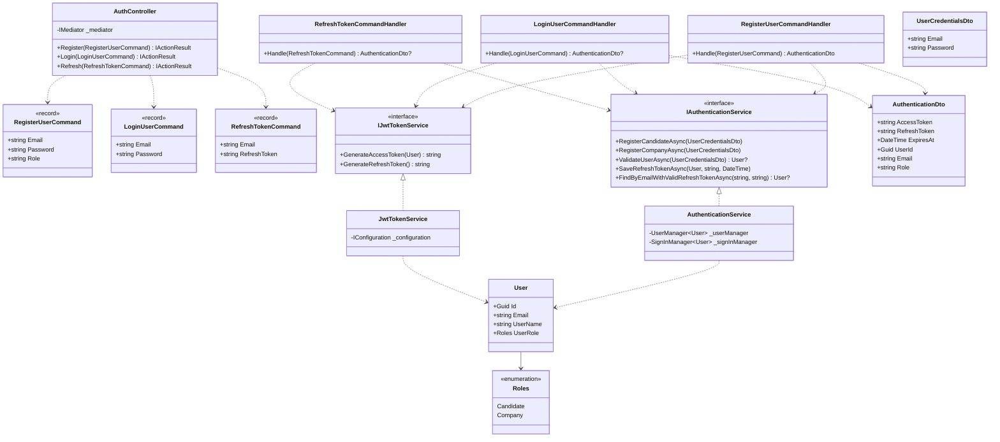

# Auth mikroservis (JobLess.IdentityServer)

Mikroservis zadužen za registraciju, prijavu i izdavanje JWT tokena za sve korisnike JobLess platforme (kandidate i kompanije). Predstavlja centralnu tačku autentifikacije — svi ostali mikroservisi veruju JWT tokenu koji ovaj servis izdaje i nezavisno ga validiraju istim potpisnim ključem.

## Odgovornosti

- Registracija novog korisnika kao **Candidate** ili **Company** 
- Čuvanje korisničkih naloga preko **ASP.NET Core Identity** 
- Provera kredencijala pri prijavi
- Izdavanje kratkotrajnog JWT pristupnog tokena i dugotrajnijeg refresh tokena
- Obnavljanje pristupnog tokena preko refresh tokena, bez ponovnog unosa lozinke
- Objavljivanje `UserRegisteredMessage` događaja na RabbitMQ, koji koristi Notification servis za slanje email dobrodošlice

## Arhitektura

Servis je organizovan po Clean Architecture principu, u 4 projekta:

```
JobLess.IdentityServer.API             → kontroleri, Program.cs (kompozicija)
JobLess.IdentityServer.Application     → MediatR komande (CQRS), DTO-ovi, interfejsi
JobLess.IdentityServer.Domain          → User entitet, Roles enum
JobLess.IdentityServer.Infrastructure  → EF Core (IdentityContext), JWT servis, Auth servis, MassTransit
```

Tok zahteva: `AuthController` → `IMediator` → `*CommandHandler` (Application) → `IAuthenticationService` / `IJwtTokenService` (implementacije u Infrastructure) → `IdentityContext` (EF Core, SQL Server).

## Dijagram klasa



## REST API

Base ruta: `/api/Auth` (kroz Gateway: `http://localhost:5000/api/Auth`).

### `POST /api/Auth/register`

Registruje novog korisnika i odmah vraća par tokena (korisnik je i prijavljen).

**Request**
```json
{
  "email": "kandidat@example.com",
  "password": "Lozinka123",
  "role": "Candidate"
}
```
`role` je `"Candidate"` ili `"Company"` (bilo koja druga vrednost se tretira kao `Candidate`).

**Response `200 OK`**
```json
{
  "accessToken": "eyJhbGciOi...",
  "refreshToken": "base64-string",
  "expiresAt": "2026-07-13T12:05:00Z",
  "userId": "b3f1...",
  "email": "kandidat@example.com",
  "role": "Candidate"
}
```

**Response `400 Bad Request`** — kada registracija ne uspe (npr. email već postoji, lozinka ne zadovoljava pravila):
```json
{ "message": "Email 'kandidat@example.com' is already taken." }
```

> Napomena: registracija ovde kreira samo Identity nalog. Profil kandidata/kompanije (lični/poslovni podaci) kreira se posebnim pozivom ka Client, odnosno Company servisu — to orkestrira frontend odmah nakon registracije.

### `POST /api/Auth/login`

**Request**
```json
{ "email": "kandidat@example.com", "password": "Lozinka123" }
```

**Response `200 OK`** — isti oblik kao kod registracije (`AuthenticationDto`).

**Response `401 Unauthorized`**
```json
{ "message": "Pogrešni kredencijali." }
```

### `POST /api/Auth/refresh`

Zamenjuje istekli pristupni token novim, na osnovu važećeg refresh tokena.

**Request**
```json
{ "email": "kandidat@example.com", "refreshToken": "base64-string" }
```

**Response `200 OK`** — nov par tokena (`AuthenticationDto`).

**Response `401 Unauthorized`**
```json
{ "message": "Nevažeći ili istekli refresh token." }
```

## Model podataka

`User : IdentityUser<Guid>` — proširuje standardnog ASP.NET Identity korisnika jednim dodatnim poljem:

| Polje | Tip | Opis |
|---|---|---|
| `Id`, `Email`, `UserName`, ... | (iz `IdentityUser<Guid>`) | standardna Identity polja |
| `UserRole` | `Roles` (enum: `Candidate = 1`, `Company = 2`) | uloga naloga |

Baza: `JobLessIdentityDb` (SQL Server), šema generisana Identity migracijama u `JobLess.IdentityServer.Infrastructure/Persistence/Migrations`.

## Događaji (MassTransit)

| Događaj | Exchange | Kada se šalje | Ko sluša |
|---|---|---|---|
| `UserRegisteredMessage(UserId, Email, Role)` | `jobless-user-registered` (fanout) | Nakon uspešne registracije | Notification servis |

## Konfiguracija

Ključne postavke (`appsettings*.json` / environment promenljive u Docker Compose-u):

| Promenljiva | Opis |
|---|---|
| `ConnectionStrings:IdentityConnectionString` | konekcija ka SQL Server bazi `JobLessIdentityDb` |
| `Jwt:Key` / `Jwt:Issuer` / `Jwt:Audience` / `Jwt:ExpirationMinutes` | parametri izdavanja JWT-a |
| `RabbitMq:Host` / `Username` / `Password` | konekcija ka RabbitMQ-u za objavljivanje događaja |

## Pokretanje

Videti opšte uputstvo u [`docs/POKRETANJE.md`](../../../docs/POKRETANJE.md). Samostalno, van Dockera (npr. iz IDE-a ili radi debagovanja), servisu su potrebni SQL Server i RabbitMQ.

**Korak 1 — pokrenuti samo infrastrukturu iz Docker Compose-a** (SQL Server + RabbitMQ, bez ostalih servisa):

```bash
cd JobLess
docker compose up -d sql-server rabbitmq
```

Sačekati da oba kontejnera budu `healthy`:

```bash
docker compose ps
```

**Korak 2 — tek onda pokrenuti Auth servis:**

```bash
cd src/Security/JobLess.IdentityServer.API
dotnet run
```

## Ručno testiranje (Swagger i terminal)

Auth kontroler nema `[Authorize]` ni na jednom endpoint-u, pa za ručno testiranje nije potreban token — dovoljno je da servis radi (videti [Pokretanje](#pokretanje)).

### Preko Swaggera

1. Otvoriti `http://localhost:5218/swagger` u pregledaču.
2. Razviti (expand) endpoint koji se testira, npr. `POST /api/Auth/register`.
3. Kliknuti **"Try it out"**.
4. U polje `Request body` uneti JSON, npr.:
   ```json
   {
     "email": "test@example.com",
     "password": "Lozinka123",
     "role": "Candidate"
   }
   ```
5. Kliknuti **"Execute"** — ispod se prikazuje generisani HTTP zahtev, status kod odgovora i telo odgovora (uključujući `accessToken`/`refreshToken`).
6. Isti postupak važi za `POST /api/Auth/login` (samo `email`/`password`) i `POST /api/Auth/refresh` (`email`/`refreshToken` iz prethodnog odgovora).

### Preko terminala (curl)

**Registracija:**
```bash
curl -X POST http://localhost:5218/api/Auth/register \
  -H "Content-Type: application/json" \
  -d '{"email":"test@example.com","password":"Lozinka123","role":"Candidate"}'
```

**Prijava:**
```bash
curl -X POST http://localhost:5218/api/Auth/login \
  -H "Content-Type: application/json" \
  -d '{"email":"test@example.com","password":"Lozinka123"}'
```

**Obnavljanje tokena** (`refreshToken` se uzima iz odgovora na register/login):
```bash
curl -X POST http://localhost:5218/api/Auth/refresh \
  -H "Content-Type: application/json" \
  -d '{"email":"test@example.com","refreshToken":"<refreshToken iz prethodnog odgovora>"}'
```

Dobijeni `accessToken` se dalje koristi kao `Authorization: Bearer <token>` header pri pozivanju zaštićenih endpoint-a drugih servisa (npr. Notification, Client, Company).

## Automatizovani testovi

Test projekat: `src/Tests/JobLess.Tests.Security` (xUnit), pokriva:

- `AuthenticationServiceTests` — registracija/validacija korisnika preko `UserManager`/`SignInManager`
- `JwtTokenServiceTests` — generisanje access/refresh tokena
- `LoginUserCommandHandlerTests`, `RegisterUserCommandHandlerTests`, `RefreshTokenCommandHandlerTests` — Application sloj (MediatR handleri)

```bash
dotnet test src/Tests/JobLess.Tests.Security
```
