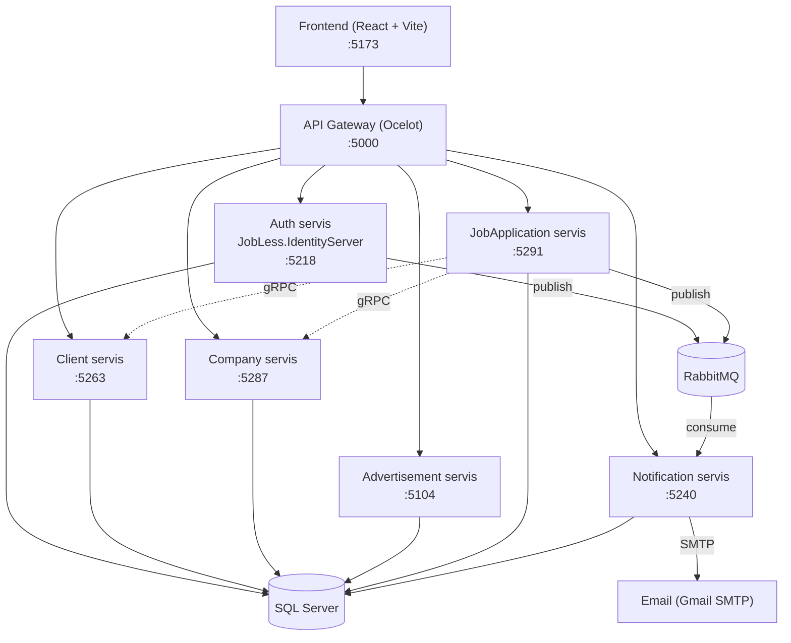

# JobLess

JobLess je veb platforma za povezivanje nezaposlenih kandidata i kompanija koje traže zaposlene — kandidati pretražuju oglase i prijavljuju se na poslove, a kompanije objavljuju oglase i upravljaju pristiglim prijavama. Aplikacija je razvijena kao seminarski rad na master studijama (predmet RS2, Matematički fakultet).

Sistem je izgrađen kao **mikroservisna arhitektura** u .NET 8, sa React frontendom i API Gateway-om kao jedinstvenom ulaznom tačkom.

## Sadržaj

- [Arhitektura](#arhitektura)
- [Mikroservisi](#mikroservisi)
- [Tehnologije](#tehnologije)
- [Struktura repozitorijuma](#struktura-repozitorijuma)
- [Komunikacija između servisa](#komunikacija-između-servisa)
- [Pokretanje projekta](#pokretanje-projekta)
- [Tim](#tim)

## Arhitektura



Svaki poslovni mikroservis prati **Clean Architecture** raspodelu po slojevima:

- **API** – kontroleri, DI kompozicija, `Program.cs`
- **Application** – CQRS (MediatR) komande/upiti, DTO-ovi, interfejsi
- **Domain** – entiteti, enumeracije, poslovna pravila
- **Infrastructure** – EF Core `DbContext`, implementacije servisa, migracije, integracije (RabbitMQ, SMTP, gRPC)

Frontend nikada ne komunicira direktno sa mikroservisima — svi zahtevi idu kroz **API Gateway** (Ocelot), koji rutira zahteve na osnovu path-a i primenjuje rate limiting.

## Mikroservisi

| Servis | Opis | Port (Docker) | README |
|---|---|---|---|
| **API Gateway** | Jedinstvena ulazna tačka, rutiranje i rate limiting (Ocelot) | 5000 | [src/ApiGateway](JobLess/src/ApiGateway/README.md) |
| **Auth (IdentityServer)** | Registracija, prijava, JWT/refresh tokeni | 5218 | [src/Security](JobLess/src/Security/README.md) |
| **Client** | Profili kandidata | 5263 (HTTP), 5264 (gRPC) | *(README u izradi)* |
| **Company** | Profili kompanija | 5287 (HTTP), 5288 (gRPC) | [src/Company](JobLess/src/Company/README.md)] |
| **Advertisement** | Oglasi za posao | 5104 | *(README u izradi)* |
| **JobApplication** | Prijave kandidata na oglase | 5291 | *(README u izradi)* |
| **Notification** | In-app i email obaveštenja | 5240 | [src/Services/Notification](JobLess/src/Services/Notification/README.md) |
| **Frontend** | React SPA | 5173 | [src/frontend](JobLess/src/frontend/README.md) |

## Tehnologije

**Backend**
- .NET 8 / ASP.NET Core Web API
- Entity Framework Core + SQL Server (Docker kontejner, po jedna baza za svaki servis)
- ASP.NET Core Identity + JWT Bearer autentifikacija
- MediatR (CQRS obrasci unutar Application sloja)
- MassTransit + RabbitMQ (asinhrona komunikacija između servisa, fanout exchange-evi)
- gRPC (sinhrona komunikacija JobApplication → Client/Company)
- Ocelot (API Gateway)
- MailKit/MimeKit (slanje email obaveštenja)
- xUnit (testiranje)

**Frontend**
- React 19 + Vite
- React Router
- React Toastify

**Infrastruktura**
- Docker / Docker Compose
- Nginx (posluživanje frontend build-a)

## Struktura repozitorijuma

```
JobLess/
├── docker-compose.yml        # orkestracija svih servisa
├── docker-up.sh               # skripta za brzo pokretanje
├── JobLess.slnx               # .NET solution
├── src/
│   ├── ApiGateway/             # Ocelot API Gateway
│   ├── Security/               # Auth mikroservis (IdentityServer)
│   ├── Services/
│   │   ├── Client/              # profili kandidata
│   │   ├── Company/             # profili kompanija
│   │   ├── Advertisement/       # oglasi
│   │   ├── JobApplication/      # prijave na oglase
│   │   └── Notification/        # obaveštenja
│   ├── Shared/
│   │   ├── JobLess.Contracts/       # deljeni MassTransit event kontrakti
│   │   ├── JobLess.Grpc.Contracts/  # .proto definicije
│   │   └── JobLess.Shared.Domain/   # zajednička domenska osnova
│   ├── Tests/                   # xUnit test projekti (po servisu)
│   └── frontend/                # React aplikacija
```

## Komunikacija između servisa

- **Sinhrona (REST preko Gateway-a)** — frontend šalje HTTP zahteve na `http://localhost:5000/api/...`, Ocelot ih prosleđuje odgovarajućem servisu.
- **Sinhrona (gRPC)** — JobApplication servis direktno (interno, mimo Gateway-a) poziva Client i Company servise preko gRPC-a da bi dobio podatke o kandidatu/kompaniji.
- **Asinhrona (RabbitMQ / MassTransit)** — servisi objavljuju domenske događaje (fanout exchange) na koje se Notification servis pretplaćuje:
  - `UserRegisteredMessage` (Auth → Notification): dobrodošlica + email
  - `JobAppliedMessage` (JobApplication → Notification): obaveštenje kompaniji o novoj prijavi
  - `ApplicationStatusChangedMessage` (JobApplication → Notification): obaveštenje kandidatu o prihvatanju/odbijanju prijave

## Pokretanje
Kompletno uputstvo (preduslovi, environment promenljive, pokretanje pojedinačnih servisa, rešavanje problema) nalazi se u [`docs/POKRETANJE.md`](./POKRETANJE.md).

Najbrži start (Docker):

```bash
git clone git@github.com:AnjaJovanovic/JobLess.git
cd JobLess/JobLess
./docker-up.sh
```
Aplikacija je dostupna na `http://localhost:5173`, a API Gateway na `http://localhost:5000`
## Tim

Projekat je razvijen timski u okviru predmeta na master studijama (Matematički fakultet, Univerzitet u Beogradu):

- Anja Jovanović, 1044/2025
- Jelena Mitrović
- Luna Rančić, 1027/2025
- Ana Veličković, 1128/2025
